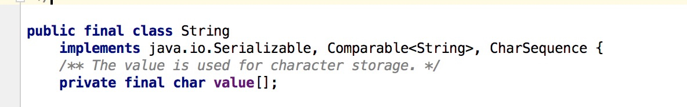
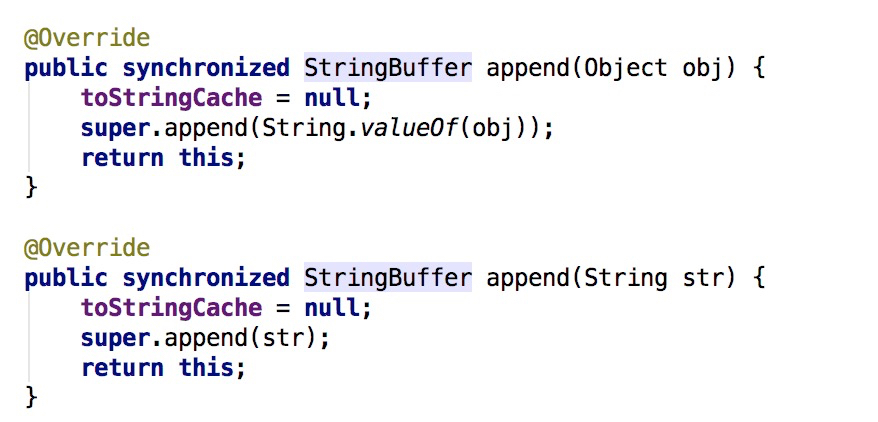
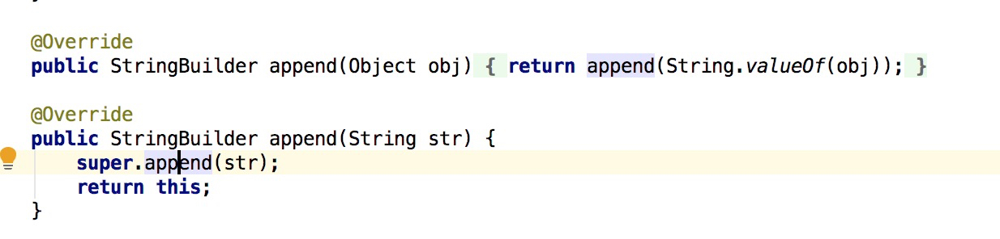

# JAVA基础

1. JAVA中的几种基本数据类型是什么，各自占用多少字节。

 答：8种基础类型，记忆方式为 1224488+boolean。1为byte，8位bit -128-127，2为short char -2^15 - 2^15-1，4为int float -2^31 - 2^31，8为double long -2^63 - 2^63-1，boolean 取决于虚拟机，1字节或4字节

2.String类能被继承吗，为什么？

不能，string的定义如下，final类不能被继承


3. String，StringBuffer，StringBuilder的区别？



1.注意synchronized关键字，StringBuffer线程安全,StringBuilder线程不安全

4.ArrayList和LinkedList有什么区别？

1.结构上，array是数组队列，list是双向链表结构
3.使用上，谁更快，插删改查，插入和删除肯定是link链表类型的数据结构快，因为array类型的数据结构在插入或删除的时候，需要将后面的位置全部后移或前移.修改和指定位置查询则是array类型的快.
4.存储上，ArrayList有初始化大小，要预留空间，LinkList有上下节点的存储

5.类的实例化顺序，比如父类静态数据，构造函数，字段，子类静态数据，构造函数，字段，当new的时候，他们的执行顺序？

当创建类对象时，先初始化静态变量和静态块，然后是非静态变量和非静态代码块，然后是构造器。由于静态成员只会被初始化一次，所以如果静态成员已经被初始化过，将不会被再次初始化。

6.用过哪些Map类，都有什么区别，HashMap是线程安全的吗,并发下使用的Map是什么，他们内部原理分别是什么，比如存储方式，hashcode，扩容，默认容量等。
JAVA8的ConcurrentHashMap为什么放弃了分段锁，有什么问题吗

HashMap，ConcurrentHashMap，TreeMap,LinkedHashMap
 hashmap不是线程安全,HashMap/ConcurrentHashMap源码会写篇专门的文章分析.

7.有没有有顺序的Map实现类，如果有，他们是怎么保证有序的

TreeMap,LinkedHashMap,TreeMap通过Comparator，linkedHashMap保证插入顺序

8.抽象类和接口的区别，类可以继承多个类么，接口可以继承多个接口么,类可以实现多个接口么？

当你关注一个事物的本质的时候，用抽象类；当你关注一个操作的时候，用接口。
类不可以继承多个类，接口可以继承多个接口，类可以实现多个接口


9.继承和聚合的区别在哪？

这问题...有点无聊

继承指的是一个类继承另外的一个类的功能，并可以增加它自己的新功能的能力，继承是类与类或者接口与接口之间最常见的关系；在Java中此类关系通过关键字extends明确标识。

聚合体现的是整体与部分、拥有的关系，此时整体与部分之间是可分离的，他们可以具有各自的生命周期；比如计算机与CPU、公司与员工的关系等；

10.IO模型有哪些，讲讲你理解的nio ，他和bio，aio的区别是啥，谈谈reactor模型。

不会

11.反射的原理，反射创建类实例的三种方式是什么？


```
//通过对象---对象.getClass()来获取c(一个Class对象)
public void get1(){
    Person p=new Person("Jack", 23);
    Class c=p.getClass();//来自Object方法
}

//通过类(类型)---任何数据类型包括(基本数据类型)都有一个静态的属性class ，他就是c 一个Class对象
public void get2(){
    Class c=Person.class;
    Class c2=int.class;
}

//通过字符串(类全名 )---能够实现解耦：Class.forName(str)
public void get3(){
    try {
        Class c=Class.forName("*.Person");
    } catch (ClassNotFoundException e) {
        e.printStackTrace();
    }
}
```


12.反射中，Class.forName和ClassLoader区别?
```
Class.forName(className)方法，内部实际调用的方法是  Class.forName(className,true,classloader);

第2个boolean参数表示类是否需要初始化，  Class.forName(className)默认是需要初始化。一旦初始化，就会触发目标对象的 static块代码执行，static参数也也会被再次初始化。

ClassLoader.loadClass(className)方法，内部实际调用的方法是  ClassLoader.loadClass(className,false);

第2个 boolean参数，表示目标对象是否进行链接，false表示不进行链接,
不进行链接意味着不进行包括初始化等一些列步骤，那么静态块和静态对象就不会得到执行
```

13.描述动态代理的几种实现方式，分别说出相应的优缺点?
14.动态代理与cglib实现的区别?
15.为什么CGlib方式可以对接口实现代理?
16.final的用途？

17.写出三种单例模式实现?

```
class SingletonHungary {
	private static SingletonHungary singletonHungary = new SingletonHungary();
	private SingletonHungary() {

	}
	public static SingletonHungary getInstance() {
		return singletonHungary;
	}
}
```

```
class SingletonLazy2 {
	private static SingletonLazy2 singletonLazy;

	private SingletonLazy2() {

	}

	public static synchronized SingletonLazy2 getInstance() {
		try {
			if (null == singletonLazy) {
				// 模拟在创建对象之前做一些准备工作
				Thread.sleep(1000);
				singletonLazy = new SingletonLazy2();
			}
		} catch (InterruptedException e) {
			e.printStackTrace();
		}
		return singletonLazy;
	}
}
```

```
class SingletonLazy5 {

	private static SingletonLazy5 singletonLazy;

	private SingletonLazy5() {

	}

	public static SingletonLazy5 getInstance() {
		try {
			if (null == singletonLazy) {
				// 模拟在创建对象之前做一些准备工作
				Thread.sleep(1000);
				synchronized (SingletonLazy5.class) {
					if(null == singletonLazy) {
						singletonLazy = new SingletonLazy5();
					}
				}
			}
		} catch (InterruptedException e) {
			// TODO: handle exception
		}
		return singletonLazy;
	}
}
```

```
//使用静态内部类实现单例模式--线程安全
class SingletonStaticInner {
	private SingletonStaticInner() {

	}
	private static class SingletonInner {
		private static SingletonStaticInner singletonStaticInner = new SingletonStaticInner();
	}
	public static SingletonStaticInner getInstance() {
		return SingletonInner.singletonStaticInner;
	}
}
```

```
enum SingletonEnum {

}
```


18.如何在父类中为子类自动完成所有的hashcode和equals实现？这么做有何优劣。


19.请结合OO设计理念，谈谈访问修饰符public、private、protected、default在应用设计中的作用。


20.深拷贝和浅拷贝区别。


21.数组和链表数据结构描述，各自的时间复杂度。


22.error和exception的区别，CheckedException，RuntimeException的区别。


23.请列出5个运行时异常。


24.在自己的代码中，如果创建一个java.lang.String类，这个类是否可以被类加载器加载？为什么

不能，因加载某个类时，优先使用父类加载器加载需要使用的类。如果我们自定义了java.lang.String这个类，	加载该自定义的String类，该自定义String类使用的加载器是AppClassLoader，根据优先使用父类加载器原理，	AppClassLoader加载器的父类为ExtClassLoader，所以这时加载String使用的类加载器是ExtClassLoader，	但是类加载器ExtClassLoader在jre/lib/ext目录下没有找到String.class类。然后使用ExtClassLoader父类的加载器BootStrap，	父类加载器BootStrap在JRE/lib目录的rt.jar找到了String.class，将其加载到内存中。这就是类加载器的委托机制。


25.什么是序列化，怎么序列化，为什么序列化，反序列化会遇到什么问题，如何解决


26.java8的新特性
